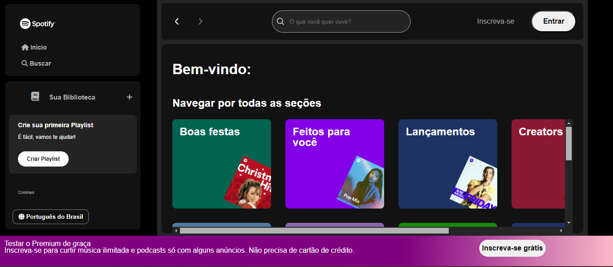

<h1 align="center"> Projeto Spotify - Alura </h1>

Modelo de uma landing page do Spotify.

  <a href="#-tecnologias">Tecnologias</a>&nbsp;&nbsp;&nbsp;|&nbsp;&nbsp;&nbsp;
  <a href="#-projeto">Projeto</a>&nbsp;&nbsp;&nbsp;|&nbsp;&nbsp;&nbsp;
  <a href="#-layout">Layout</a>&nbsp;&nbsp;&nbsp;
  

  

 

  

## 🚀 Tecnologias

Esse projeto foi desenvolvido com as seguintes tecnologias:

- HTML e CSS
- JavaScript
- Git e Github

## 💻 Projeto

Esse projeto tem como base a página inicial do Spotify para práticas das tecnologias listadas acima. 

---

Feito pela Imersão Alura Front-end 2024